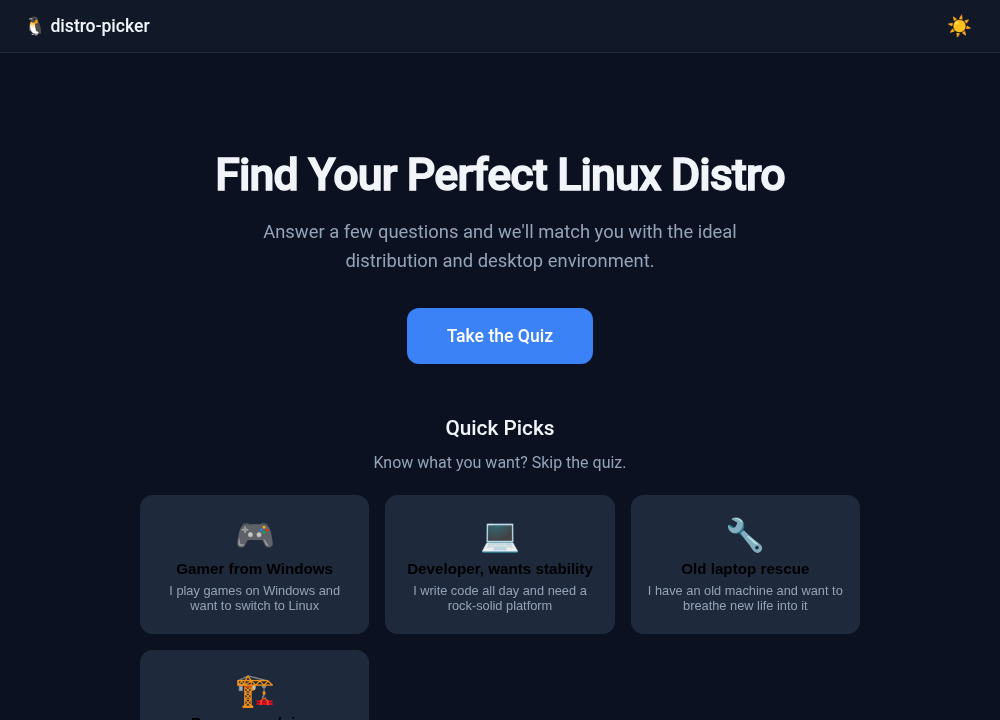
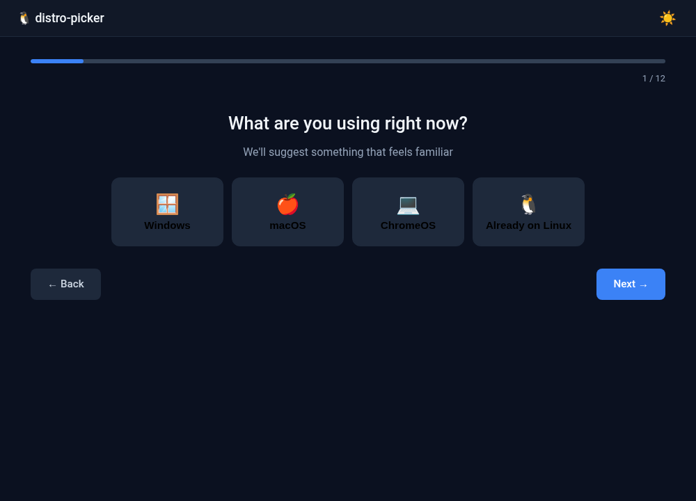
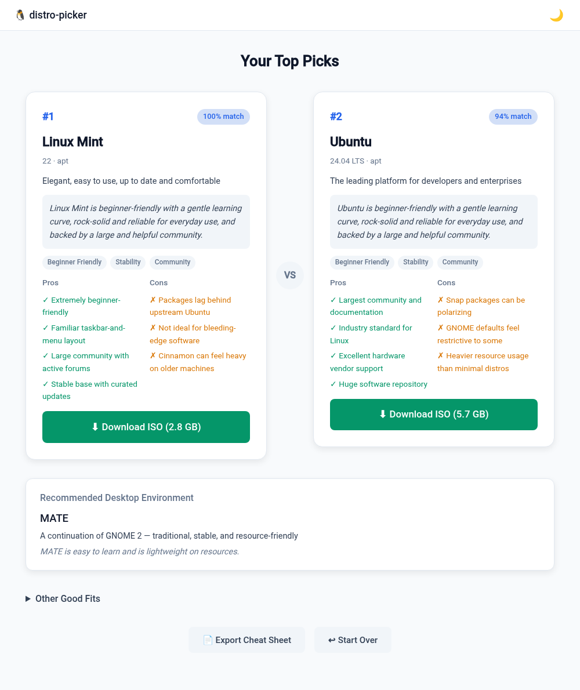

# distro-picker

A small, self-contained app that helps people figure out which Linux distribution to install. Answer 12 questions (or pick a quick profile) and get a side-by-side comparison of the two best-fitting distros, a desktop environment recommendation, and a one-click ISO download link.

Runs locally as a single binary — no install, no account, no internet required after download.



## Why

Every Linux forum and subreddit is full of "which distro should I use?" posts. The answer always depends on the same handful of factors (experience, hardware, use case, GPU, etc.), but newcomers don't know what questions to ask or how to weigh the answers.

distro-picker encodes that decision tree into a weighted scoring engine so people can skip the forum post and get a solid recommendation in under a minute.

## How it works

The app bundles 19 distros and 9 desktop environments, each tagged with trait scores across ~15 dimensions (beginner-friendliness, stability, gaming support, NVIDIA compatibility, etc.). Your quiz answers generate a weight vector, and the final ranking is a dot product of your weights against each distro's traits.

It's not magic  it's the same logic an experienced Linux user applies when recommending a distro, just automated.



## Features

- **12-question quiz** covering OS background, experience, use case, hardware, GPU, stability preference, and more
- **Quick profiles** for common archetypes (gamer from Windows, developer wanting stability, old laptop rescue, power user)
- **Side-by-side comparison** of the top 2 picks with pros, cons, trait badges, and personalized "why this fits you" reasoning
- **Desktop environment recommendation** factoring in RAM, familiarity, and customization preference
- **One-click ISO download** button on every result card
- **Cheat sheet export** - downloads a Markdown file with your results and getting-started steps
- **Dark/light theme** with system preference detection
- **Fully responsive** - works on mobile



## Supported distros

Linux Mint, Ubuntu, Fedora, Pop!_OS, Nobara, Bazzite, CachyOS, Garuda, openSUSE Tumbleweed, openSUSE Leap, Debian, EndeavourOS, Arch, Manjaro, Zorin OS, elementary OS, MX Linux, NixOS, Void Linux.

Desktop environments: GNOME, KDE Plasma, Cinnamon, XFCE, COSMIC, MATE, Budgie, LXQt, Hyprland.

## Usage

Download the binary for your platform from the [releases](https://github.com/TaintedAngel/distro-picker/releases) page, then run it:

```
# Linux
chmod +x distro-picker-linux-amd64
./distro-picker-linux-amd64

# Windows - just double-click distro-picker-windows-amd64.exe
```

Your browser opens automatically to `http://localhost:9514`. Close the terminal (or Ctrl+C) to stop.

**Flags:**

```
--port 8080       use a different port
--no-browser      don't auto-open the browser
```

## Building from source

Requires Go 1.22+.

```
git clone https://github.com/TaintedAngel/distro-picker.git
cd distro-picker
make build          # builds bin/distro-picker for your platform
make run            # builds and runs
make cross          # cross-compiles for linux/amd64, linux/arm64, windows/amd64
make release        # cross + sha256 checksums
```

## Project structure

```
cmd/picker/          entrypoint, CLI flags, browser open, signal handling
internal/engine/     distro/DE catalog, question bank, scoring algorithm
internal/server/     HTTP handlers, JSON API
web/                 frontend — vanilla HTML/CSS/JS, no build step
```

The entire frontend is embedded into the Go binary via `//go:embed`, so the output is always a single self-contained file.

## Adding or updating distros

All distro data lives in `internal/engine/catalog.go`. Each entry is a struct with metadata, trait scores (0–1 floats), pros, and cons. Add a new entry to the `Distros` slice and rebuild.

Questions and their trait weight mappings are in `internal/engine/questions.go`. Quick profiles are in `internal/engine/recommend.go`.

## License

MIT
